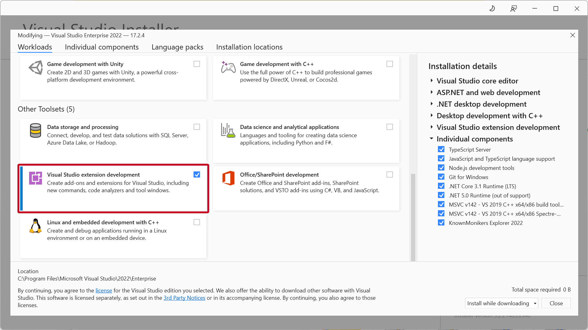
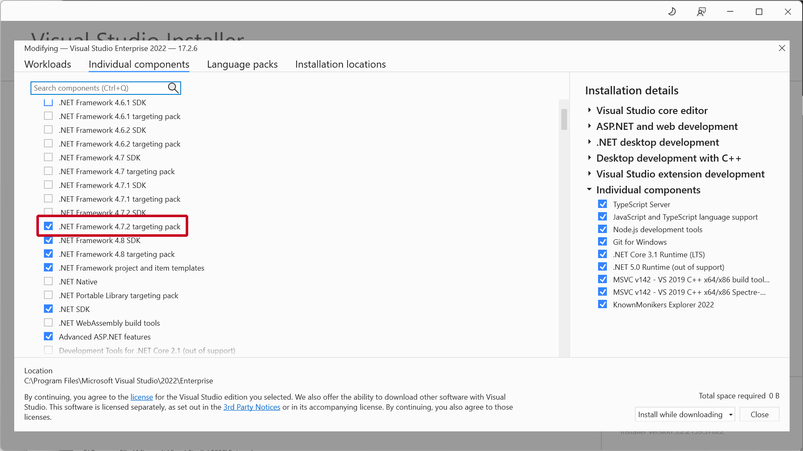
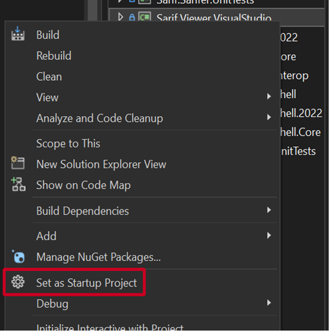
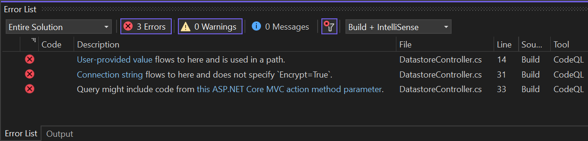
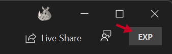
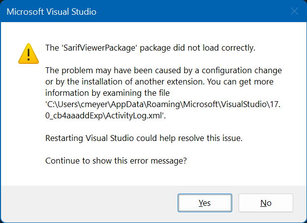

# Contributing to the SARIF Viewer for Visual Studio
This project welcomes contributions and suggestions.  Most contributions require you to agree to a Contributor License Agreement (CLA) declaring that you have the right to, and actually do, grant us the rights to use your contribution. For details, visit https://cla.microsoft.com.

When you submit a pull request, a CLA-bot will automatically determine whether you need to provide a CLA and decorate the PR appropriately (e.g., label, comment). Simply follow the instructions provided by the bot. You will only need to do this once across all repos using our CLA.

This project has adopted the [Microsoft Open Source Code of Conduct](https://opensource.microsoft.com/codeofconduct/). For more information see the [Code of Conduct FAQ](https://opensource.microsoft.com/codeofconduct/faq/) or contact [opencode@microsoft.com](mailto:opencode@microsoft.com) with any additional questions or comments.

## Overview
This document guides you through the steps necessary to begin development work on the SARIF Viewer extension for Visual Studio. It also provides useful debugging tips and key breakpoint locations.

## First-time setup

### 1. Install Visual Studio
You can use VS 2019 or 2022 for SARIF Viewer dev work, but you will need both installed to fully test your changes.
[Visual Studio 2019](https://visualstudio.microsoft.com/vs/older-downloads/)
[Visual Studio 2022](https://visualstudio.microsoft.com/vs/enterprise/) 

Within the Visual Studio Installer:
- On the **Workloads** tab, select the **Visual Studio extension development** workload in the Other Toolsets group:

- On the **Individual Components** tab, select the **.NET Framework 4.7.2 targeting pack** component:

### 2. Clone the repository
- **Using git.exe**
    `C:\Git> git clone https://github.com/microsoft/sarif-visualstudio-extension`

- **Using [GitHub Desktop](https://desktop.github.com/)**
File > Clone repository > URL tab

### 3. Run BuildAndTest.cmd
*This step is required before you can build or debug in Visual Studio*

    C:\Git\SarifVS> BuildAndTest

### 4. Open the solution in Visual Studio 2019 or 2022
`C:\Git\SarifVS\src\Sarif.Viewer.VisualStudio.sln`

### 5. Set the correct extension project as the default

 - For VS 2019: In Solution Explorer, right click the Sarif.Viewer.VisualStudio project and select **Set as Startup Project**
   from the context menu
 - For VS 2022: In Solution Explorer, right click the Sarif.Viewer.VisualStudio.2022 project and select **Set as Startup Project** from the context menu.

## Architecture notes

 - Nearly all of the extension's core code lives in the **Sarif.Viewer.VisualStudio.Core** project. This is a shared project that
   is referenced by the Sarif.Viewer.VisualStudio and Sarif.Viewer.VisualStudio.2022 projects.
   
 - VS extensions always contain a class that derives from either Microsoft.VisualStudio.Shell.Package or AsyncPackage. Our extension's package class is called `SarifViewerPackage` (**src\Sarif.Viewer.VisualStudio.Core\SarifViewerPackage.cs**). The initialization method is InitializeAsync. This method sets up all the extension's components and event handlers.

 - The Viewer includes a bunch of extension methods for classes in the SARIF SDK. They can be
   found in:
   - **src\Sarif.Viewer.VisualStudio.Core\Sarif\**

 - Many methods in the extension interact with the Visual Studio UI. Such methods must be executed on VS's main thread, which can be ensured by calling `ThreadHelper.JoinableTaskFactory.SwitchToMainThreadAsync()`
You will also see methods that use `ThreadHelper.ThrowIfNotOnUIThread()`. This is done when the caller is expected to be running on the main thread.

 -  Visual Studio's UI is built on the XAML UI framework. The extension's XAML files can be found in:
    - **src\Sarif.Viewer.VisualStudio.Core\Controls\**
    - **src\Sarif.Viewer.VisualStudio.Core\Themes\**
    - **src\Sarif.Viewer.VisualStudio.Core\Views\**

    Corresponding C# classes can be found in:
    - **src\Sarif.Viewer.VisualStudio.Core\Converters\**
    - **src\Sarif.Viewer.VisualStudio.Core\Fixes\**
    - **src\Sarif.Viewer.VisualStudio.Core\Models\**
    - **src\Sarif.Viewer.VisualStudio.Core\ViewModels\**
- Visual Studio's Error List is the primary means of viewing and interacting with SARIF results:

The code that interacts with the Error List can be found in the **src\ Sarif.Viewer.VisualStudio.Core\ErrorList\** folder. The model class for Error List items is in **src\Sarif.Viewer.VisualStudio.Core\Models\SarifErrorListItem.cs**.
Other important classes:
  - The service primarily responsible for creating Error List items from SARIF results is `ErrorListService` in **src\Sarif.Viewer.VisualStudio.Core\ErrorList\ErrorListService.cs**.
  - The `SarifErrorListEventProcessor` class in **src\Sarif.Viewer.VisualStudio.Core\ErrorList\SarifErrorListEventProcessor.cs** is responsible for handling events fired by the Error List.
  - The `SarifTableDataSource` in **src\Sarif.Viewer.VisualStudio.Core\ErrorList\SarifTableDataSource.cs** is the data structure passed to the Error List. It contains a collection of `SarifResultTableEntry` instances which provide properties for the Error List items. It also provides methods for changing the item collection.

- The extension has a platform that supports plugin-style services which can proactively retrieve scan results from arbitrary upstream sources. *This section will be completed once this feature has reached the main branch.*

## Debugging
- When you start the Viewer in the debugger, it will run in the VS "Exp" environment which is isolated from the retail product installation. The Exp environment is indicated by this badge in the upper right corner of the VS window:

This behavior is triggered by the devenv.exe `/rootsuffix Exp` command line switch, which is specified in the extension project Properties > Debug > Command line arguments textbox.

- If a problem (usually an exception) occurs while the extension is starting up, VS will pop this dialog:

The XML log file noted here contains useful information that can help you resolve the issue.
**_HOT TIP!_** _You can copy the contents of any Windows message box by pressing Ctrl+C, then pasting into Notepad for easy access to text such as the file path shown above._

## Breakpoints
Here are some key locations at which to set breakpoints.
- **Extension startup**
`SarifViewerPackage.InitializeAsync`

- **Menu item handler**
`OpenLogFileCommands.MenuItemCallbackAsync`

- **SARIF Explorer tool window**
`SarifExplorerWindow.Control_Loaded`

- **Editor pane text adornments**
`ResultTextMarker.GetTags`
`ResultTextMarker.NavigateTo`

- **Result manager middleware (log data -> extension UI)**
`CodeAnalysisResultManager -> pretty much everything!`

- **Error List**
`ErrorListService.ProcessLogFileCoreAsync`
`ErrorListService.WriteRunToErrorList`

- **Error List events**
`SarifErrorListEventProcessor.PostprocessSelectionChanged`
`SarifErrorListEventProcessor.PreprocessNavigate`
`SarifErrorListEventProcessor.PostprocessNavigate`

- **Result table entry data model**
`SarifResultTableEntry.ctor`

- **Result table data model**
`SarifTableDataSource.AddErrors`
`SarifTableDataSource.ClearErrorsForLogFiles`
`SarifTableDataSource.RemoveError`

- **File system watchers**
`SarifFolderMonitor.StartWatch`
`SarifFolderMonitor.Watcher_SarifLogFileCreated`
`SarifFolderMonitor.Watcher_SarifLogFileDeleted`
`SarifLogsMonitor.StartWatch`
`SarifLogsMonitor.Watcher_SarifLogFileRenamed`
`SarifLogsMonitor.Watcher_SarifLogFileChanged`

- **Fixes**
`EditActionPreviewProvider.CreateChangePreviewAsync`
`EditActionPreviewProvider.CreateNewDifferenceViewerAsync`
`FixSuggestedActionsSource.ctor`
`FixSuggestedActionsSource.CalculatePersistentSpans`
`FixSuggestedActionsSource.GetSelectedErrors`
`FixSuggestedActionsSource.CreateActionSetFromErrors`

## Test Coverage
All code changes should be accompanied by unit tests. Code should always be designed to maximize test coverage.
- The **Sarif.Viewer.VisualStudio.UnitTests** project provides many tests that illustrate testing approaches and can be used as a model for new tests
- The extension's code follows common patterns that are broadly applicable for increasing testability
